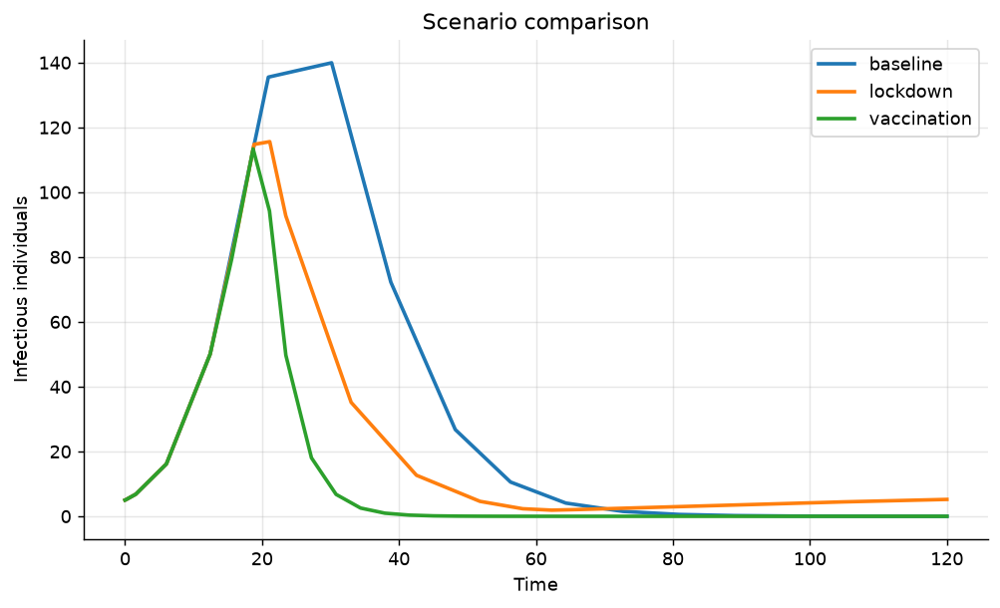
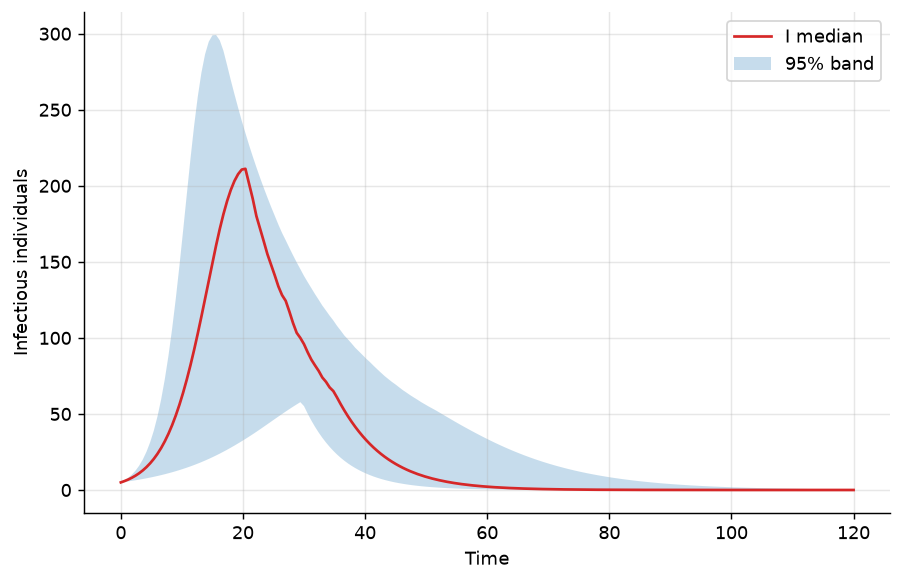

Scenario Analysis: Interventions and Ensembles
==============================================

Two related tools help answer "what if" questions:

* :mod:`epimodels.interventions` — time-bounded parameter changes
  (lockdowns, vaccination rollouts, behaviour change) with side-by-side
  scenario comparison;
* :mod:`epimodels.ensembles` — many simulations under parameter uncertainty,
  summarized with quantile bands.

Intervention scenarios
----------------------

An :class:`~epimodels.interventions.Intervention` modifies one parameter
over a time window, either multiplicatively (``factor``) or absolutely
(``new_value``). A :class:`~epimodels.interventions.Scenario` bundles a
model with parameters, initial conditions and interventions:

.. code-block:: python

    from epimodels.continuous import SIR
    from epimodels.interventions import Intervention, Scenario, ScenarioComparison

    model = SIR()
    params = {"beta": 0.4, "gamma": 0.2}  # R0 = 2
    common = dict(params=params, initial_conditions=[995, 5, 0],
                  trange=[0, 120], totpop=1000)

    baseline = Scenario("baseline", model, **common)

    lockdown = Scenario(
        "lockdown", model,
        interventions=[
            # 60% contact reduction between days 20 and 60
            Intervention("beta", start=20, end=60, factor=0.4),
        ],
        **common,
    )

    vaccination = Scenario(
        "vaccination", model,
        interventions=[
            # permanent 50% transmission reduction from day 20,
            # plus a temporary recovery boost
            Intervention("beta", start=20, factor=0.5),
            Intervention("gamma", start=20, end=90, new_value=0.4),
        ],
        **common,
    )

    cmp = ScenarioComparison(baseline, [lockdown, vaccination]).run()

    cmp.peak("I")          # {'baseline': 140, 'lockdown': 116, 'vaccination': 113}
    cmp.final_size("R")    # {'baseline': 800, 'lockdown': 477, 'vaccination': 371}
    cmp.plot("I")          # trajectories of all scenarios on one axes

Interventions are evaluated *inside* the ODE right-hand side, so the
parameter changes smoothly follow the schedule at each integration step.
Multiple interventions can be combined per scenario, and ``new_value``
overrides a parameter absolutely instead of scaling it (as the vaccination
scenario above does for ``gamma``).

Uncertainty ensembles
---------------------

:func:`~epimodels.ensembles.simulate_ensemble` runs ``n_sims`` realizations,
each drawing parameters from a sampler you provide, and collects the
trajectories on a common time grid:

.. code-block:: python

    import numpy as np
    from epimodels.continuous import SIR
    from epimodels.ensembles import simulate_ensemble

    model = SIR()
    rng = np.random.default_rng(0)

    ensemble = simulate_ensemble(
        model,
        n_sims=200,
        param_sampler=lambda: {
            "beta": rng.uniform(0.3, 0.6),
            "gamma": 0.2,
        },
        initial_conditions=[995, 5, 0],
        trange=[0, 120],
        totpop=1000,
    )

    len(ensemble)                 # 200 realizations
    ensemble.traces["I"].shape    # (200, 121) — sims x time points

    q = ensemble.quantiles([0.025, 0.5, 0.975])
    q["I"][0.5]                   # median trajectory

    ensemble.summary()            # final size / peak statistics
    ensemble.plot_band("I")       # median with 95% band
    ensemble.plot_band("I", show_reps=True)  # overlay individual runs

Initial conditions can also be sampled by passing a callable, and
``n_jobs > 1`` parallelizes the realizations across processes.
