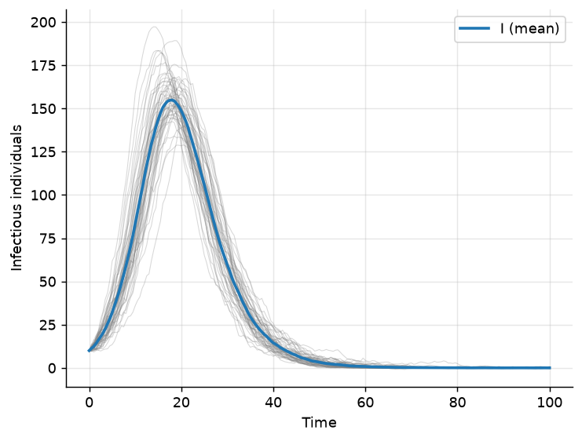

Stochastic Differential Equation Models
=======================================

The :mod:`epimodels.sde` module inserts demographic (environmental) noise
between the fully deterministic ODE models and the exact event-based CTMC
models. Any :class:`~epimodels.continuous.ContinuousModel` can be wrapped as
a Langevin-type stochastic differential equation,

.. math::

    dy = f(t, y)\,dt + D(t, y)\,dW,

where the drift :math:`f` is the model's deterministic right-hand side and
the diffusion defaults to the demographic square-root approximation
:math:`D_{ii} = \sqrt{\sigma\,|f_i(t, y)|}`. Integration uses diffrax/JAX
(Euler–Maruyama), so installation of the ``jax`` extra is required:

.. code-block:: bash

    pip install epimodels[jax]

Basic usage
-----------

.. code-block:: python

    from epimodels.continuous import SIR
    from epimodels.sde import SDEModel

    sde = SDEModel(SIR())

    sde(
        [990, 10, 0], [0, 100], 1000,
        {"beta": 0.5, "gamma": 0.25},
        n_sims=50,          # independent trajectories
        seed=42,            # reproducibility
    )

    sde.get_mean()                    # ensemble mean trajectory
    sde.get_quantiles(0.95)           # 95% band per variable
    sde.plot_traces("I")              # replicate spaghetti + mean

With ``n_sims=1`` the traces are 1D arrays; with ``n_sims > 1`` they have
shape ``(n_sims, n_points)``, mirroring the CTMC interface.

Noise magnitude
---------------

``noise_scale`` multiplies the default diffusion (1.0 corresponds to
demographic noise magnitude). Setting it to 0 reproduces the deterministic
ODE exactly — useful as a sanity check:

.. code-block:: python

    deterministic = SDEModel(SIR(), noise_scale=0.0)

Custom diffusion
----------------

For full control, pass a diffusion matrix function
``(t, y, params) -> (n_vars, n_noise)``:

.. code-block:: python

    def my_diffusion(t, y, params):
        # e.g. noise only in the infectious compartment
        import jax.numpy as jnp
        return jnp.diag(jnp.array([0.0, 0.5, 0.0]))

    sde = SDEModel(SIR(), diffusion=my_diffusion)

Limitations
-----------

Models whose ``_model`` uses numpy-specific functions (e.g. ``np.tanh``),
interpolation callables or internal history state (SIRSEI-family,
``SIRSNonAutonomous`` with callables) cannot run under JAX tracing. The
classic SIR/SIS/SIRS/SEIR-family models work as-is.

Numerical caveat: the Euler–Maruyama integrator does not preserve
non-negativity. When a compartment is very small (e.g. a handful of
initial infectives) the √-demographic noise can push it negative, in the
worst case destabilizing the integration. Seed simulations with a
sufficiently large infected population (10+), and keep ``dt`` moderate.
